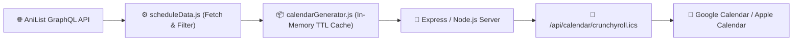

#  Tool-Crunchyroll-Schedule-2026 (Crunchyroll Schedule to iCalendar Feed)

<div align="center">

[](https://nodejs.org/)
[](https://graphql.anilist.co)
[](https://icalendar.org/)
[](https://render.com/)
[](LICENSE)

**ระบบดึงและแปลงตารางฉายอนิเมะลิขสิทธิ์สตรีมมิ่งบน Crunchyroll เป็นปฏิทิน iCalendar (.ics)**  
*ซิงค์กำหนดการออกอากาศตรงเข้า Google Calendar, Apple Calendar, หรือ Outlook ได้อัตโนมัติ*

[🐛 แจ้งปัญหา (Report Bug)](https://github.com/PhuriphatTyPeZ3r0/Tool-Crunchyroll-Schedule-2026/issues) · [✨ เสนอแนะฟีเจอร์ (Request Feature)](https://github.com/PhuriphatTyPeZ3r0/Tool-Crunchyroll-Schedule-2026/issues)

</div>

---

##  สารบัญ (Table of Contents)
- [📖 เกี่ยวกับโปรเจกต์ (About The Project)](#-เกี่ยวกับโปรเจกต์-about-the-project)
- [✨ ฟีเจอร์หลัก (Key Features)](#-ฟีเจอร์หลัก-key-features)
- [📡 แหล่งข้อมูลและการบายพาส (Data Source & Anti-Bot Strategy)](#-แหล่งข้อมูลและการบายพาส-data-source--anti-bot-strategy)
- [🛠️ สถาปัตยกรรมและเทคโนโลยี (Architecture)](#️-สถาปัตยกรรมและเทคโนโลยี-architecture)
- [🚀 การติดตั้งและเริ่มต้นใช้งาน (Getting Started)](#-การติดตั้งและเริ่มต้นใช้งาน-getting-started)
- [🌐 การนำไปใช้งานและซิงค์ปฏิทิน (Subscription Guide)](#-การนำไปใช้งานและซิงค์ปฏิทิน-subscription-guide)
- [👨‍💻 ผู้พัฒนา (Author)](#-ผู้พัฒนา-author)

---

## 📖 เกี่ยวกับโปรเจกต์ (About The Project)

> **ที่มาและปัญหา (Problem Statement):**  
> ผู้ชมอนิเมะส่วนใหญ่ต้องคอยเปิดแอปหรือเช็กเว็บไซต์ทีละแห่งเพื่อดูว่าอนิเมะเรื่องที่กำลังติดตามจะปล่อยตอนใหม่ในวันและเวลาใด อีกทั้ง Crunchyroll ไม่มีระบบส่งออกตารางปฏิทินสากล (.ics feed) สำหรับซิงค์เข้า Google Calendar ของผู้ใช้โดยตรง

**แนวทางการแก้ไข (Solution):**  
**Tool-Crunchyroll-Schedule-2026** ให้บริการฟีดปฏิทิน `.ics` อัตโนมัติ:
- ดึงข้อมูลตารางเวลาฉายจริง (Simulcast broadcast times)
- กรองเฉพาะรายการที่สตรีมมิ่งบน Crunchyroll
- สร้าง UID เสถียรสำหรับแต่ละ Episode พร้อมระบุเวลาสากลแบบ UTC
- ให้บริการผ่าน HTTP Endpoint ที่สามารถนำ URL ไป Subscribe ใน Google Calendar หรือ Apple Calendar ได้ทันที

---

## ✨ ฟีเจอร์หลัก (Key Features)

- [x] 🔄 **Automatic Calendar Sync:** อัปเดตตารางเวลาฉายของแต่ละสัปดาห์เข้าปฏิทินของผู้ใช้อัตโนมัติ
- [x] ⚡ **High-Performance Caching:** แคชข้อมูลในหน่วยความจำ (In-Memory Soft-TTL Cache) เสิร์ฟไวไม่หน่วง
- [x] 🛡️ **Stable Episode UIDs:** ป้องกันการเกิด Event ซ้ำซ้อน (Duplicate Events) ในปฏิทิน
- [x] 🌍 **Timezone-Aware (UTC):** จัดการเวลาตามมาตรฐานสากล แปลงเป็นเวลาท้องถิ่นของอุปกรณ์ผู้ใช้โดยอัตโนมัติ

---

## 📡 แหล่งข้อมูลและการบายพาส (Data Source & Anti-Bot Strategy)

Crunchyroll API ภายในติดตั้งระบบป้องกัน **Cloudflare Bot Management (TLS/JA3 Fingerprinting)** ซึ่งบล็อกคำขอระดับ HTTP ปกติทั้งหมด (HTTP 403) 

โปรเจกต์นี้จึงเลือกใช้สถาปัตยกรรม **Public GraphQL Aggregation**:
- เชื่อมต่อผ่าน **AniList Public GraphQL API** (`https://graphql.anilist.co`) ที่เปิดกว้างและเสถียร
- ทำการ Filter สตรีมมิ่งลิงก์ที่ระบุผู้ให้บริการเป็น Crunchyroll
- แนบ Direct Link ตรงกลับไปยังหน้าดูของ Crunchyroll ในรายละเอียดของทุก Event

---

## 🛠️ สถาปัตยกรรมและเทคโนโลยี (Architecture)



---

## 🚀 การติดตั้งและเริ่มต้นใช้งาน (Getting Started)

### ขั้นตอนการรันบนเครื่อง Local
1. **โคลน Repository:**
   ```bash
   git clone https://github.com/PhuriphatTyPeZ3r0/Tool-Crunchyroll-Schedule-2026.git
   cd Tool-Crunchyroll-Schedule-2026
   ```

2. **ติดตั้ง Dependencies:**
   ```bash
   npm install
   ```

3. **รันเซิร์ฟเวอร์:**
   ```bash
   npm start
   ```

4. ทดสอบ Endpoint ได้ที่: `http://localhost:3000/api/calendar/crunchyroll.ics`

---

## 🌐 การนำไปใช้งานและซิงค์ปฏิทิน (Subscription Guide)

1. Deploy โค้ดนี้ไปยังบริการคลาวด์ฟรี (เช่น [Render](https://render.com))
2. คัดลอก URL ของฟีด: `https://<your-service>.onrender.com/api/calendar/crunchyroll.ics`
3. ใน **Google Calendar**:
   - ไปที่เมนูด้านซ้าย **Other calendars (+)** ➔ **From URL**
   - วาง URL ลงไป แล้วกด **Add calendar**
   - กำหนดการฉายอนิเมะจะปรากฏและอัปเดตบนมือถือของคุณตลอดทั้งฤดูกาล!

---

##  ผู้พัฒนา (Author)

**Phuriphat Hemakul (PhuriphatTyPeZ3r0)**
-  นักศึกษา สาขาวิศวกรรมคอมพิวเตอร์และปัญญาประดิษฐ์ (CAI)
-  สถาบันการจัดการปัญญาภิวัฒน์ (PIM)
-  GitHub: [@PhuriphatTyPeZ3r0](https://github.com/PhuriphatTyPeZ3r0)
-  Portfolio: [portfolio-phuriphatizamus-projects.vercel.app](https://portfolio-phuriphatizamus-projects.vercel.app)
